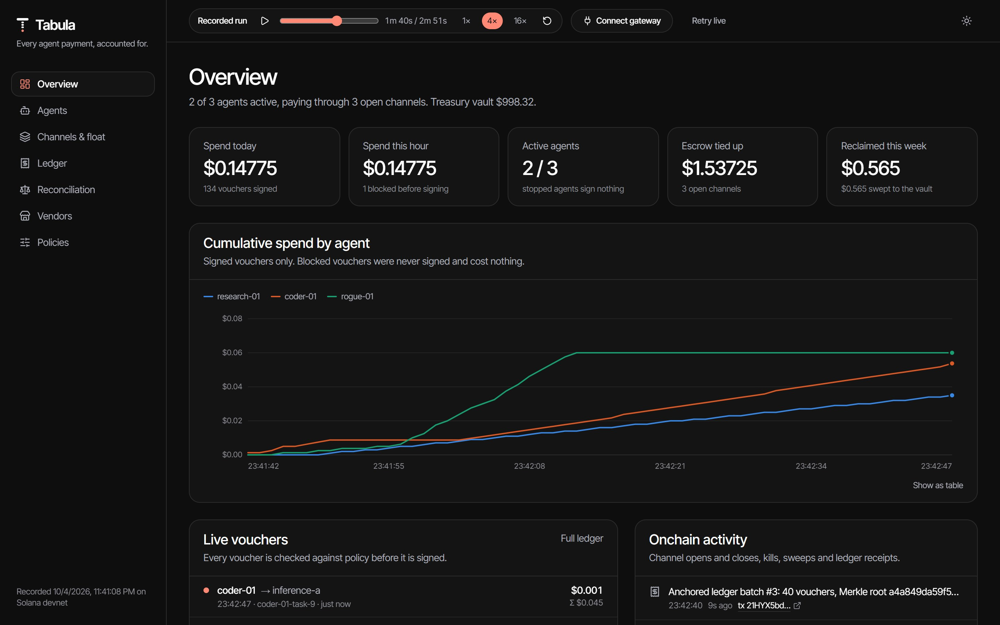
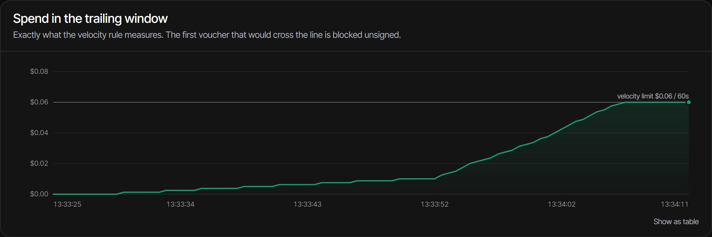
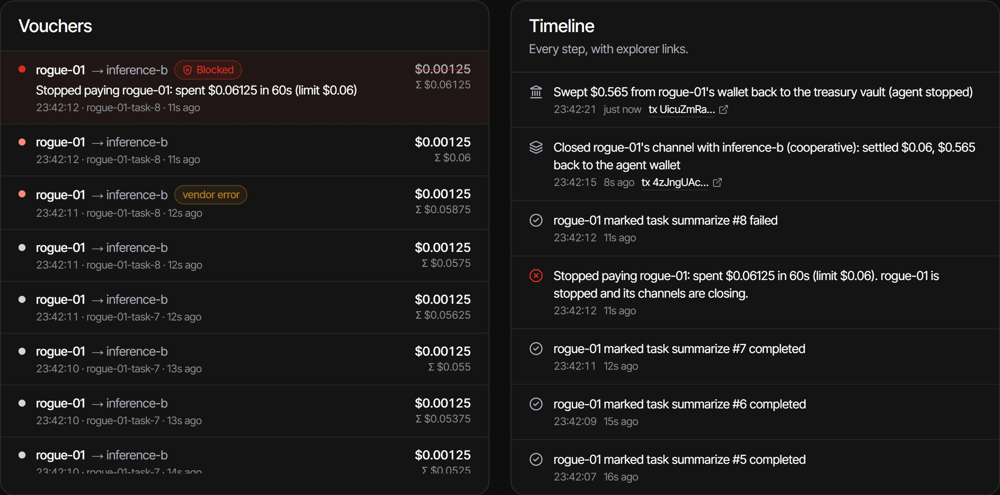
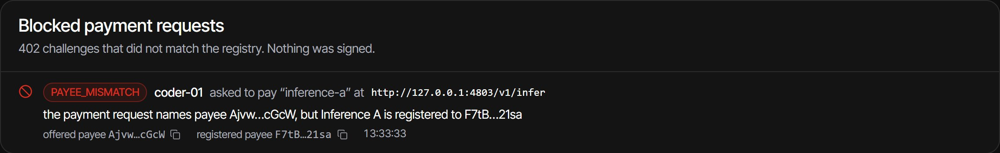
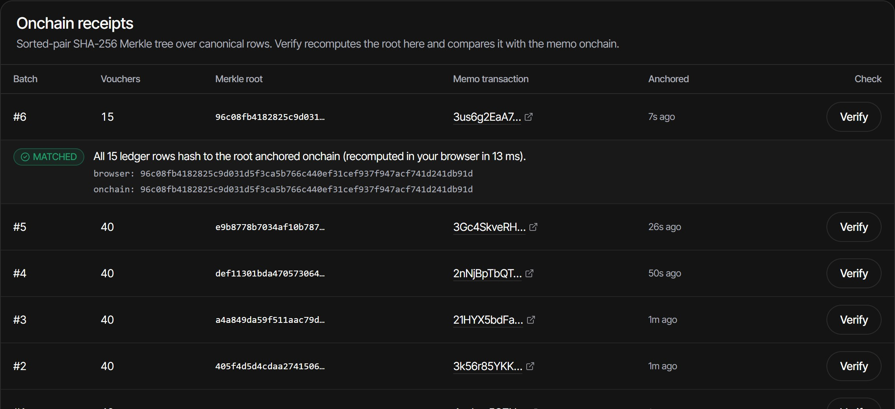
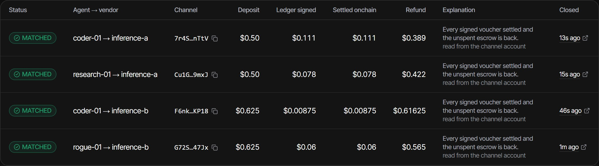
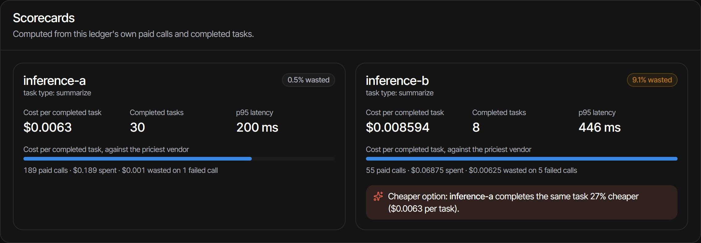

<div align="center">


# Tabula

**Every agent payment, accounted for.**

Spend control and treasury for AI agents that pay through Solana payment channels.

[**Live site**](https://tabula-agents.vercel.app) ·
[**Dashboard**](https://tabula-agents.vercel.app/app) ·
[**Film (81 s)**](https://tabula-agents.vercel.app/film) ·
[**Pitch**](docs/PITCH.md)
<!-- DEMO VIDEO: add " · [**Demo video**](<url>)" here once uploaded -->

Built for Colosseum's Crypto World's Fair · Solana track · MIT

</div>



## The problem

AI agents can now pay per call. [Solana payment channels](https://solana.com/news/payment-channels-1-million-payments-per-second)
(launched September 3, 2026) let an agent escrow a deposit once, then stream thousands of signed vouchers to a
vendor off-chain, and settle in a single transaction.

That makes per-call pricing work, and it moves real spending to where nobody is watching:

- **The books see two transactions per channel**, the open and the close. Every payment in between is invisible
  to wallets, multisigs and accountants.
- **A voucher is money the moment it is signed.** A prompt-injected agent can drain its escrow at machine speed,
  long before a human looks.
- **A payment request can name the wrong payee.** An agent that follows a poisoned link pays whoever the 402
  challenge names.
- **Escrow is idle money**, and paid calls that fail are still paid for.

## The solution

Tabula is the buyer's side of the stream. Agents get an API key; Tabula holds their signing keys and sits
between them and the vendors they pay.

| | |
|---|---|
| **Gate every voucher** | Each voucher is checked against policy *before* it is signed: per-task and daily budgets, unit-price caps, vendor allowlists, velocity windows, spend anomalies. A guarded signer re-checks the kill switch, monotonicity and the deposit. |
| **Stop a runaway agent** | The voucher that would cross a limit is refused unsigned. The agent is stopped, its channels close at the last signed voucher (or are force-closed onchain if the vendor is down), and the refund is swept back to the vault. |
| **Block swapped payees** | Every 402 payment request is checked against a vendor registry (payee, mint, program, price, splits), and the open transaction is simulated so only the deposit can leave. A mismatch is refused before anything is signed. |
| **Treasury, not just guardrails** | A Squads v4 vault funds each agent wallet just in time through onchain allowances, so a daily ceiling holds even if every off-chain check failed. A float manager sizes deposits and sweeps idle channels. |
| **Prove every dollar** | Every 40 vouchers, a Merkle root of the ledger is anchored with the Memo program, and the dashboard recomputes it in your browser. Each closed channel reconciles to `MATCHED` against onchain settlement. Every voucher exports to CSV. |
| **Vendor scorecards** | Waste % and cost per completed task from your own paid calls, with a cheaper option when there is one. |

<table>
  <tr>
    <td width="50%"><br /><sub><b>Velocity limit.</b> rogue-01's trailing spend climbs to the limit; the next voucher is refused.</sub></td>
    <td width="50%"><br /><sub><b>Kill path.</b> Blocked voucher, cooperative close, refund swept to the vault, each with an explorer link.</sub></td>
  </tr>
  <tr>
    <td width="50%"><br /><sub><b>Swapped payee.</b> A "faster mirror" named a different payee: refused before any signature.</sub></td>
    <td width="50%"><br /><sub><b>Receipts.</b> Verify recomputes the Merkle root in the browser and compares it with the chain.</sub></td>
  </tr>
  <tr>
    <td width="50%"><br /><sub><b>Reconciliation.</b> Ledger vs. onchain settlement, channel by channel.</sub></td>
    <td width="50%"><br /><sub><b>Scorecards.</b> Waste and cost per completed task, with a cheaper option.</sub></td>
  </tr>
</table>

## Why it's different

Existing controls govern **one payment at a time**. A payment channel is a **stream**: one onchain open,
thousands of off-chain vouchers, one close. The risk lives inside the stream and in the escrow float.

| Tool | What it governs |
|---|---|
| x402 payment firewalls | one payment request at a time |
| Wallet policy engines | what a key may sign, one transaction at a time |
| Squads spending limits | withdrawals from a multisig |
| **Tabula** | **the voucher stream itself:** every voucher before it is signed, the escrow float, the close and refund, and a ledger that reconciles to onchain settlement, under an onchain allowance ceiling |

Tabula uses Squads as the treasury rather than replacing it, and works with the stock `@solana/mpp` session
protocol, so vendors change nothing.

## Try it in two minutes

The [hosted dashboard](https://tabula-agents.vercel.app/app) replays a run recorded on **Solana devnet** on
2026-10-04. Every onchain step links to the devnet explorer.

1. **Overview:** three agents paying two inference vendors per call; vouchers stream into the ledger.
2. **Vendors** → *Blocked payment requests:* coder-01's swapped-payee request, refused before signing.
3. **Agents → rogue-01:** the trailing-spend chart hits the velocity limit at 1:04 and voucher #49 is refused
   (open it directly with [`?replay&t=60`](https://tabula-agents.vercel.app/app/agents/rogue-01?replay&t=60)).
4. **Ledger:** press **Verify** on any batch; your browser recomputes the Merkle root and matches the memo.
5. **Reconciliation:** 4/4 channels `MATCHED`.

**What the recorded run shows**

| | |
|---|---|
| Vouchers | 214 signed, 1 blocked |
| Runaway agent | voucher #49 refused 19 s after the prompt injection; channel closed at $0.06 settled, $0.565 back to the vault |
| Swapped payee | blocked as `PAYEE_MISMATCH`, nothing signed |
| Idle float | $0.61625 reclaimed from an abandoned channel |
| Receipts | 6/6 ledger batches verified against their onchain memos |
| Reconciliation | 4/4 channels `MATCHED`; the vault went down exactly what vendors settled ($0.22775) |
| Scorecards | inference-b wasted 9.1% of paid calls; inference-a does the same task 26% cheaper |

## Architecture

```mermaid
flowchart LR
  subgraph Agents
    A1[research-01]
    A2[coder-01]
    A3[rogue-01]
  end
  subgraph Tabula gateway
    API[Agent API<br/>per-agent API keys]
    CV[Challenge verifier<br/>registry + simulation]
    PE[Policy engine<br/>pure, property-tested]
    GS[Guarded signer<br/>Tabula-held keys]
    LG[(Ledger<br/>Postgres + Drizzle)]
    FM[Float manager<br/>sizing, idle sweep]
    AN[Anchorer<br/>Merkle roots]
  end
  subgraph Vendors
    V1[inference-a<br/>@solana/mpp session server]
    V2[inference-b]
  end
  subgraph Solana
    PC[Payment channels program]
    SQ[Squads v4 vault<br/>+ onchain allowances]
    MM[Memo program]
  end
  WEB[Dashboard<br/>Next.js]

  A1 & A2 & A3 -->|API key only| API
  API --> CV -->|402 challenge OK| PE --> GS
  GS -->|signed voucher| V1 & V2
  GS --> LG
  CV -->|open channel| PC
  FM -->|pull deposit just in time| SQ
  FM -->|close, refund, sweep| PC
  AN -->|batch root| MM
  LG --> AN
  LG -->|REST + live feed| WEB
```

**How a payment flows:** fund (a Squads vault grants each agent an onchain daily allowance) → verify (the
vendor's 402 challenge is checked and the open simulated) → gate (policy approves each voucher before the
guarded signer signs) → stop (a tripped rule closes channels and sweeps the refund home) → prove (Merkle roots
anchored, channels reconciled).

### Built on Solana

| Program | ID | Used for |
|---|---|---|
| Payment channels | `CHNLxYvVA28MJP9PrFuDXccuoGXAx7jBacfLEkahyGsX` | channels opened with a Tabula-held `authorized_signer`, vouchers, settle, close, distribute |
| Subscriptions & Allowances | `De1egAFMkMWZSN5rYXRj9CAdheBamobVNubTsi9avR44` | recurring per-agent allowances: the onchain ceiling |
| Squads v4 | `SQDS4ep65T869zMMBKyuUq6aD6EgTu8psMjkvj52pCf` | the treasury vault |
| Memo | `MemoSq4gqABAXKb96qnH8TysNcWxMyWCqXgDLGmfcHr` | ledger batch receipts (`tabula:v1 batch=… root=…`) |

The key finding behind the design: a channel's `authorized_signer` is bound at open and need not be the payer,
so Tabula opens every channel with its own voucher key while the agent's wallet pays. Agents never hold a key
that can sign a voucher. Details and the spike that proved it: [`docs/FACTS.md`](docs/FACTS.md).

### Repository

| Path | What it is |
|---|---|
| `packages/policy` | The pure rule engine (no I/O): 63 tests, 100% branch coverage, fast-check invariants (nothing signed above the deposit or after a kill; every block is the first violating voucher). |
| `packages/ledger` | Drizzle schema on Postgres (Supabase hosted, PGlite locally), canonical rows, browser-safe Merkle trees with proofs, reconciliation, scorecards. |
| `packages/solana` | Payment-channels client (vendored Codama build), voucher encoding, Squads and allowance helpers, sandbox cheatcodes, keys. |
| `apps/gateway` | The Fastify gateway: sessions, custody, kill path, float manager, anchoring, reports, event stream. |
| `apps/vendor-mock` | Demo vendors running the unmodified `@solana/mpp` session server. |
| `apps/agents` | The scripted demo agents. |
| `apps/web` | Landing page, dashboard (`/app`), film (`/film`). For hosting, the same gateway and vendor code runs as Next.js route handlers on one shared Postgres ledger. |
| `scripts/` | `setup` (vault, allowances, registry), `demo`, `verify-batch`, spikes, film and screenshot capture. |

**Stack:** TypeScript, `@solana/kit` 6.10, `@solana/mpp` 0.11 (vendored), Squads v4, Fastify, Next.js 16,
Drizzle + Postgres, React Three Fiber, Vitest + fast-check, Biome.

## Run it locally

Requires Node ≥ 22.13 and pnpm 11. Runs against the hosted **Solana Payment Sandbox**
(`https://402.surfnet.dev:8899`, a mainnet clone with test balances) by default: no wallet, no faucet, no real
funds.

```sh
pnpm i
pnpm setup     # Squads vault with $1,000 sandbox USDC, $5/day allowance per demo agent, vendor registry, policies
pnpm demo      # the full story in ~3 minutes; add --hold to keep the gateway up afterwards
```

Then watch it in the dashboard:

```sh
pnpm --filter @tabula/web build
pnpm --filter @tabula/web start   # http://localhost:3000/app
```

With `pnpm demo --hold` running, the dashboard connects live: the event feed, stop/resume, policy edits and idle
sweeps all work. Without a gateway it replays the recorded run (`/app?replay`, or `/app?replay&t=59` to open at
0:59).

**The demo's story:** at 0:00 three agents open channels funded from the vault's allowances. At 0:25 coder-01
follows a poisoned link to a "faster mirror" and is blocked (`PAYEE_MISMATCH`). At 0:45 rogue-01 reads a
prompt-injected ticket; the velocity rule refuses the voucher that would cross the limit, the agent is stopped,
and its refund is swept to the vault. At 2:00 the float manager closes an abandoned channel. The close-out
verifies every batch against its memo, reconciles every channel, prints the scorecards and exports a CSV.

### Tests

```sh
pnpm test                                        # 126 unit tests: policy, ledger, gateway, solana, vendor-mock
pnpm --filter @tabula/gateway test:integration  # 19 integration tests against the live sandbox
pnpm lint && pnpm typecheck
```

The sandbox integration tests cover 500 vouchers on one channel with #501 refused, the swapped payee, a hostile
challenge caught by simulation, the kill path (cooperative and forced onchain), exact vault accounting, and
receipts including detection of an edited ledger row.

## What is real and what is simulated

- **Real:** the payment-channels, Squads v4, Subscriptions & Allowances and Memo programs; the `@solana/mpp`
  session protocol on both sides; every transaction, voucher signature, receipt and reconciliation read.
- **Simulated:** the funds (sandbox cheatcodes or a devnet test mint, never real USDC), the vendors (mock
  inference APIs with seeded errors, empty responses and timeouts, running the stock session server against the
  real program), and the agents (scripted; the prompt injection is staged).
- **Not built yet:** automatic channel top-ups (an exhausted channel refuses with `CHANNEL_DEPOSIT` and the
  agent opens a new session), treasury yield, approval workflows, and an MCP server.

## Roadmap

1. Tabula as the policy and custody backend for agent payment tooling (a `pay` CLI remote signer).
2. An MCP server: agents call Tabula as a tool, with budgets and receipts built in.
3. Approval flows above a threshold, with one-tap approval.
4. Accounting exports by vendor, task and team.
5. Automatic top-ups, scorecard-based routing, and yield on idle float.
6. Mainnet with design partners.

## Deploying

<details>
<summary>Vercel (the site and the replay dashboard)</summary>

1. Import the repo in Vercel and set **Root Directory** to `apps/web`. Next.js is detected and the workspace
   installs from the repo root.
2. Set `ENABLE_EXPERIMENTAL_COREPACK=1` so Vercel uses the pinned `pnpm@11.25.0`.
3. Deploy. `pnpm build` copies detect-gpu's benchmark tables into `public/gpu` and runs `next build`.

The hosted dashboard replays the recorded run. To point it at a live gateway, set
`NEXT_PUBLIC_TABULA_GATEWAY_URL`, or use **Connect gateway** in the dashboard header.

</details>

<details>
<summary>Hosted live mode, waitlist and the film</summary>

**Live mode (optional).** The route handlers run the gateway only when `DATABASE_URL` (the Supabase transaction
pooler) is set, with the devnet settings (`TABULA_CLUSTER=devnet`, `TABULA_MINT`, `TABULA_KEY_SEED`,
`TABULA_RPC_URL`) and `CRON_SECRET`, after `pnpm setup` has written the devnet treasury into that database.
Until then every gateway route answers `503 the live ledger is offline` and the dashboard replays the recorded
run, so a visitor never sees a broken page.

**Waitlist.** The landing page's form writes to the ledger's `waitlist` table (row level security on, like every
ledger table), using `DATABASE_URL` or the `POSTGRES_URL` that Vercel's Supabase integration sets. Apply new
migrations with `pnpm tsx --env-file=.env.local scripts/migrate.ts`. Sign-ups are rate-limited per network,
and the answer never reveals whether an email was already on the list.

**The film.** `/film` draws the motion graphic in code from the recorded run's numbers. `pnpm film:render`
(with the site running and ffmpeg installed) renders it to `apps/web/public/film/tabula-film.mp4`.

</details>

Progress and verified ecosystem facts: [`docs/STATUS.md`](docs/STATUS.md) · [`docs/FACTS.md`](docs/FACTS.md).

## License

[MIT](LICENSE)
